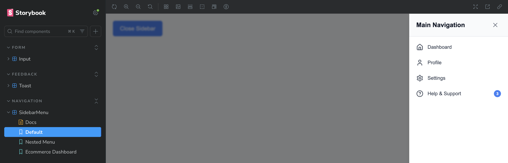

# React Component Library with Storybook

A modern, accessible React component library built with TypeScript, Storybook, and Framer Motion. Features three highly customizable components with smooth animations and comprehensive documentation.

## 🚀 Quick Start

### Prerequisites

- Node.js 16+
- npm or yarn

### Setup Instructions

1. **Clone and set up the project**

```bash
git clone https://github.com/ystyslo/storybook_ui.git
cd storybook_ui
npm install
```

2. **Run Storybook**

```bash
npm run storybook
```

## 📁 Project Structure

```
src/
├── components/
│   ├── Input/
│   │   ├── Input.tsx
│   │   ├── Input.module.css
│   │   └── index.ts
│   ├── Toast/
│   │   ├── Toast.tsx
│   │   ├── Toast.module.css
│   │   └── index.ts
│   └── SidebarMenu/
│       ├── SidebarMenu.tsx
│       ├── SidebarMenu.module.css
│       └── index.ts
├── stories/
│   ├── Input.stories.tsx
│   ├── SidebarMenu.stories.data.tsx
│   ├── SidebarMenu.stories.tsx
│   └── Toast.stories.tsx
└── index.ts
```

## 🧩 Components

### 1. Input Component

A versatile input component with multiple types, password visibility toggle, and clearable functionality.

**Key Features:**

- **Multi-type support**: text, password, email, number
- **Password visibility toggle**: Eye icon to show/hide password
- **Clearable functionality**: Optional X button to clear input
- **Multiple sizes**: small, medium, large
- **Validation states**: Error styling and helper text
- **Accessibility**: Proper ARIA labels and keyboard navigation

**Usage:**

```tsx
import { Input } from "./components/Input";

// Input example
<Input
  type="password"
  placeholder="Enter password"
  showPasswordToggle
  clearable
/>;
```

**Props:**

- `type`: Input type (text, password, email, etc.)
- `placeholder`: Placeholder text
- `clearable`: Show clear button
- `showPasswordToggle`: Show password visibility toggle
- `size`: Input size (small, medium, large)
- `error`: Error state styling
- `helperText`: Helper text below input
- `label`: Input label
- `disabled`: Disabled state

### 📸 Input Component Screenshots

#### Default input


#### Error input


#### Different sizes of input


### 2. Toast Component

A notification component with smooth animations, multiple types, and flexible positioning.

**Key Features:**

- **Multiple types**: Success, error, warning, info with appropriate icons
- **Flexible positioning**: 6 position options (corners and centers)
- **Auto-dismiss**: Configurable duration with progress bar
- **Manual close**: Optional close button
- **Smooth animations**: Fade and slide transitions with Framer Motion
- **Stacking**: Multiple toasts stack properly
- **Responsive**: Mobile-optimized layout

**Usage:**

```tsx
import { Toast } from "./components/Toast";

// Toast example
<Toast
  type="error"
  title="Error!"
  message="Something went wrong"
  persistent
  showCloseButton
  duration={3000}
/>;
```

**Props:**

- `type`: Toast type (success, error, warning, info)
- `message`: Toast message
- `title`: Optional title
- `duration`: Auto-dismiss duration in ms
- `position`: Toast position
- `persistent`: Disable auto-dismiss
- `showCloseButton`: Show close button
- `onClose`: Close callback

### 📸 Toast Component Screenshots

#### Long message toast


#### Error toast


### 3. SidebarMenu Component

A sliding sidebar navigation with nested menus, animations, and responsive design.

**Key Features:**

- **Slide animations**: Smooth left/right slide with backdrop
- **Nested navigation**: Multi-level accordion menus
- **Responsive design**: Mobile-optimized with full-width on small screens
- **Customizable**: Width, position, overlay, and behavior options
- **Icons and badges**: Support for menu item icons and notification badges
- **Accessibility**: Keyboard navigation and ARIA labels

**Usage:**

```tsx
import { SidebarMenu } from "./components/SidebarMenu";

const menuItems = [
  {
    id: "dashboard",
    label: "Dashboard",
    icon: <Home size={20} />,
    onClick: () => console.log("Dashboard clicked"),
  },
  {
    id: "settings",
    label: "Settings",
    icon: <Settings size={20} />,
    children: [
      {
        id: "profile",
        label: "Profile Settings",
        onClick: () => console.log("Profile clicked"),
      },
    ],
  },
];

<SidebarMenu
  isOpen={isOpen}
  onClose={() => setIsOpen(false)}
  items={menuItems}
  title="Navigation"
/>;
```

**Props:**

- `isOpen`: Sidebar open state
- `onClose`: Close callback
- `items`: Menu items array
- `width`: Sidebar width (default: 280px)
- `title`: Sidebar title
- `slideFrom`: Animation direction (left, right)
- `showOverlay`: Show backdrop overlay
- `closeOnItemClick`: Close sidebar when item is clicked

### 📸 Sidebar Component Screenshots

#### Default sidebar



#### Leftsided nested sidebar


## 🎨 Storybook Features

- **Interactive Controls**: Live prop editing for all components
- **Multiple Viewports**: Test responsive design at different screen sizes
- **Auto Documentation**: Generated from TypeScript prop interfaces
- **Story Organization**: Logical grouping by component type

## 📦 Build Configuration

The project uses modern build tools:

- **Next.js** – React framework for fast development, server-side rendering, and optimized production builds
- **TypeScript**: Static type checking and IntelliSense
- **ESLint**: Code quality and consistency rules
- **Prettier**: Automatic code formatting
- **Storybook**: Component development and documentation

## 🎯 Assessment Completion

This implementation successfully addresses all requirements:

✅ **React Project with Storybook**: Next.js + TypeScript + Storybook setup  
✅ **Smart Input Component**: Multi-type, password toggle, clearable  
✅ **Toast Notifications**: Auto-dismiss, positioning, animations  
✅ **Sliding Sidebar Menu**: Nested navigation, responsive design  
✅ **Comprehensive Stories**: Multiple configurations for each component  
✅ **Screenshots**: Visual documentation of all component states  
✅ **Bonus Features**: Controls addon, Framer Motion animations, TypeScript  
✅ **Code Quality**: ESLint, Prettier, proper TypeScript usage  
✅ **Documentation**: Detailed README with setup instructions
